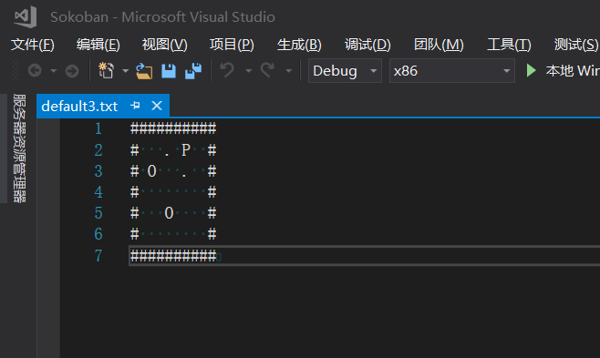

# Game-Algorithm
在这里总结一些自己学习到的游戏算法，和自己制作的小游戏

## Sokoban 
[一个由C++开发的控制台推箱子小游戏。](https://github.com/YiuWingRepository/Sokoban)

### 使用方式

- W,A,S,D 来进行方向控制。
- 切换到ReadLevelsFunction分支，在工程目录下的Projects文件夹下的Levels中可以创建自己的关卡，如下所示。使用vs来编辑效果更佳哦

其中
- **#** 表示墙壁
- P 表示玩家
- O 表示箱子
- 空格 表示空地
-  .   表示目标点
- 地图的边界必须被封闭起来，不允许有开口